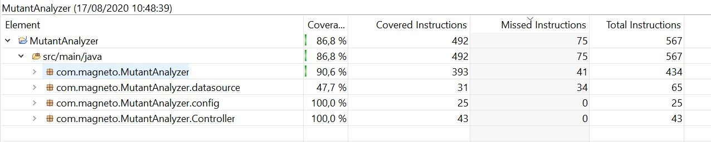

# ml-challenge
API Rest para ayudar al amigo Magneto a detectar ADN mutante. 

## Servicios
El servicio se encuentra desplegado en Google Cloud como Java de App Engine en https://meli-gss.appspot.com

### /mutant
```
https://meli-gss.appspot.com/mutant
```
#### Request

+ Method: POST
+ Content Type: application/json
+ Json Schema
```{
  "type": "object",
  "properties": {
    "dna": {
      "type": "array",
      "items": [
        {
          "type": "string"
        }
      ]
    }
  },
  "required": [
    "dna"
  ]
}
```

Ejemplo de request:
```
  {"dna":["ATGCGA", "CAGGGC", "TTATGT", "AGAAGG", "CCCCTA", "TCACTG"]}
```

#### Response  
Código de respuesta | Descripción
---|:--- 
OK (200) | En caso de que la matriz de ADN analizada sea mutante
FORBIDDEN (403) | En caso de que la matriz ADN analizada sea de un NO mutante. 
BAD REQUEST (400) | En caso de que la matriz ADN no sea valida.

### /stat
```
https://meli-gss.appspot.com/stat
```
#### Request
+ Method: GET
+ Params: None

#### Response 
+ Json Schema
```
{
  "type": "object",
  "properties": {
    	"count_human_dna": {
      	"type": "integer"
    },
    	"count_mutant_dna": {
      	"type": "integer"
    }, 
		"ratio": {
      	"type": "number"
    }
  }
}
```

Ejemplo de response:
```
  { "count_human_dna": 17, "count_mutant_dna": 9, "ratio": "0.35" }
```

## Implementación, desarrollo y testing 
### Tecnologías y frameworks utilizados
La aplicación fue desarrollada utilizando Java 1.8 y desplegada en Google Cloud AppEngine utilizando Google Cloud SQL (MySql) como base de datos.

Entre las dependencias de uso mas destacables se encuentran:
- Spring Boot
- Spring Web
- Spring Jdbc
- EhCache
- JUnit (test)
- Mockito (test)
- AssertJ (test)

### Test-Automáticos, Code coverage > 80% 


